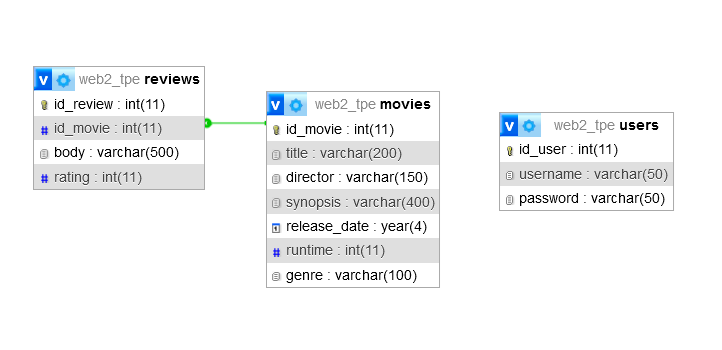

# Trabajo Práctico Especial | Web 2 - 2024
### Grupo 156
- Gallardo Thaiel Aran
> mail: thaiel.a.gallardo@gmail.com
- Manzalini Abitante Malena
> mail: manzamale@gmail.com

# Reseñas de Películas
En este sitio se podrán compartir opiniones sobre las **películas** que se encuentren disponibles en la página, creando una **reseña/review.**
En las **reviews,** además de la opinión del usuario, podremos ver una calificación, y el titulo de la película reseñada
A su vez se podrán subir películas en caso de no estar ya disponibles. Solo los usuarios pueden agregar, editar y elminiar reseñas/peliculas
> como **usuario** quiero poder seleccionar una **película** para la cual generar una **reseña**

Para desplegar el sitio usamos **XAMPP**, en un servidor con **Apache** y **MySQL.** El archivo **.sql** en el repositorio se importa en phpMyAdmin, nosotros utilizamos el nombre **"web2_tpe"** como indica el archivo.
Para bajar los archivos del repositorio, iniciar git y realizar un **git clone** para copiar todos los datos a la maquina local.

Hay que loguear para ingresar a las funcionalidades de administrador (**user:** webadmin, **pass:** admin)

## Diagrama Entidad-Relación

